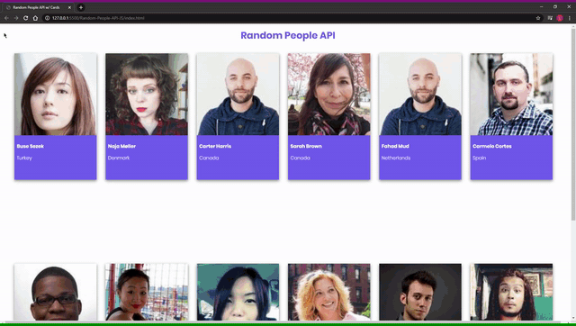
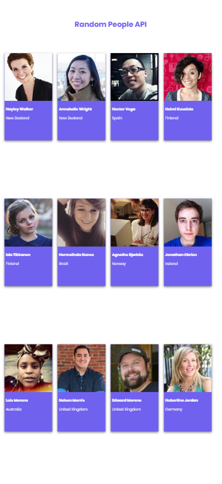

  <a href="#rocket-Technologies">Technologies</a>&nbsp;&nbsp;&nbsp;|&nbsp;&nbsp;&nbsp;
  <a href="#-Project">Project</a>&nbsp;&nbsp;&nbsp;|&nbsp;&nbsp;&nbsp;
  <a href="#-layout">Layout</a>&nbsp;&nbsp;&nbsp;|&nbsp;&nbsp;&nbsp;
  <a href="#-How-to-contribute">How to contribute</a>&nbsp;&nbsp;&nbsp;|&nbsp;&nbsp;&nbsp;
  <a href="#memo-license">License</a>

 

  

 

## :heavy_check_mark: :computer: Web Result

<h1 align="center">
    
</h1>

## :heavy_check_mark: :iphone: Mobile Result

<h1 align="center">
    
</h1>

## 🚀 Technologies

This project was developed with the following technologies:

- [HTML5](https://en.wikipedia.org/wiki/HTML5)
- [CSS3](https://en.wikipedia.org/wiki/Cascading_Style_Sheets#CSS_3)
- [Javascript](https://www.javascript.com/)
- [API](https://api.randomuser.me/)

## 💻 Project

The ***Random User API***,  is a *Responsive* Page that uses a API to request Random People Information using **fetch**, and with **Javascript** can control the information, and put in **HTML**. The Project purpose is use a ***API***, with ***fetch*** and to ***HTML*** use ***innerHTML***, this is made with **HTML**, **CSS** and **Javascript**.

## 🔖 Layout

You can view the project layout in the format via [this link](<https://codepen.io/leonardoj02/pen/QWyyzje>).

## 🤔 How to contribute

- Make a fork;
- Create a branch with your feature: `git checkout -b my-feature`;
- Do commit with your changes: `git commit -m 'feat: My new feature'`;
- Do a push for your branch: `git push origin my-feature`.

After the merge of your pull request was made, you can delete your branch.

## :memo: License

This project is under License MIT. See the documentation [LICENSE](LICENSE.md) for more details.

---

Developed by <a href="https://www.linkedin.com/in/leonardojesus02/">Leonardo Jesus</a>
